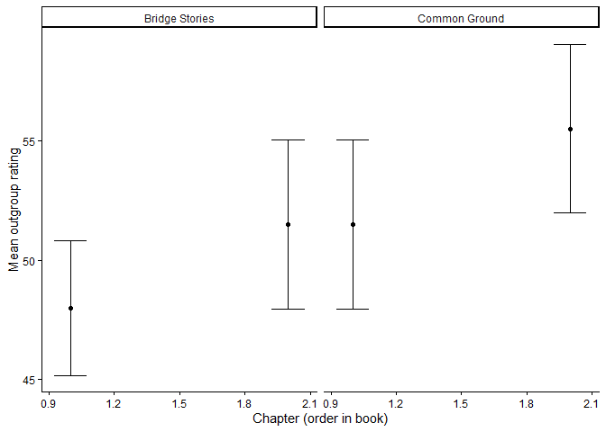

<!-- README.md is generated from README.Rmd. Please edit that file -->

# nalanda: R Toolbox to answer the question: Do books really change lives?

## Overview

The **nalanda** package provides tools for simulating, summarizing, and
plotting chapter-level AI reading responses. It is designed for
workflows that ask whether books shift prosocial attitudes, outgroup
warmth, and affective polarization across chapters or across whole
books.

## Installation

You can install the development version of nalanda from
[GitHub](https://github.com/) with:

``` r
install.packages(
  'nalanda', repos = c(
    'https://centerconflictcooperation.r-universe.dev', 
    'https://cloud.r-project.org'))
```

## Example workflow

This example uses a small synthetic dataset so it renders quickly and
does not require running live AI simulations.

``` r
library(nalanda)

summary_chapters <- summarize_chapter_scores(toy_sim_results)

summary_chapters[, c(
  "book", "chapter", "sim",
  "mean_post_outgroup", "mean_delta_gap"
)]
#> # A tibble: 4 × 5
#>   book           chapter     sim mean_post_outgroup mean_delta_gap
#>   <chr>          <chr>     <int>              <dbl>          <dbl>
#> 1 Bridge Stories chapter_1     2               48             -7  
#> 2 Bridge Stories chapter_2     2               51.5           -7.5
#> 3 Common Ground  chapter_1     2               51.5           -4.5
#> 4 Common Ground  chapter_2     2               55.5           -6
```

Use the summarized output directly with the plotting helpers:

``` r
plot_chapter_scores_faceted(
  summary_chapters,
  dv = "post_outgroup",
  y_label = "Mean outgroup rating"
)
```

<div class="figure">


<p class="caption">

Synthetic chapter-level summary of post-reading outgroup scores.
</p>

</div>

The same workflow scales to:

- results returned by `run_ai_on_chapters()`
- saved `.rds` simulation outputs
- book-level summaries via
  `summarize_chapter_scores(..., aggregate_level = "book")`
- visualization with `plot_chapter_trajectories()`,
  `plot_chapters_over_time()`, and `plot_forest_books()`

For API setup and a live minimal simulation example, see the vignette:

``` r
vignette("getting-started", package = "nalanda")
```

## About the Name

The package is named after [Nalanda
Mahavihara](https://en.wikipedia.org/wiki/Nalanda), one of the most
renowned centers of learning in ancient India. Founded in the 5th
century CE, Nalanda was a Buddhist monastic university that attracted
scholars from across Asia and became a symbol of knowledge, wisdom, and
the pursuit of learning through texts and collaboration.

This name is particularly fitting for a package related to the study of
books and prosociality, reflecting the historical significance of
Nalanda as a center for both scholarly texts and the cooperative
exchange of ideas. The connection resonates with contemporary research
on how books and shared learning can foster prosocial behavior and
cooperation.

The package also includes a small helper to explore historical facts
about Nalanda University:

``` r
library(nalanda)

# Get a random fact about Nalanda University
nalanda()
#> [1] "Xuanzang, the 7th-century Chinese monk and scholar, studied at Nalanda for several years and documented its curriculum."
```

Learn more about related research on books, learning, and prosociality:
[Mind and Life Europe - 2024 EVA Recipients &
Projects](https://mindandlife-europe.org/2024-eva-recipients-projects/)
