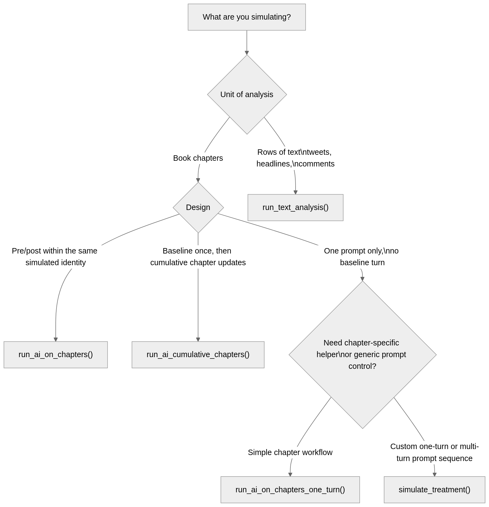

# nalanda: R Toolbox to answer the question: Do books really change lives?

## Overview

The **nalanda** package helps researchers work with large language
models from R. It supports structured prompting workflows, simulation
studies, and LLM-based text analysis with outputs that are easy to
inspect, summarize, and plot.

Two common use cases are:

- psychological text analysis, where models annotate or score text data
  row by row
- simulation workflows, where models are prompted as synthetic
  respondents across repeated scenarios

A central goal of the package is to support different experimental
designs in LLM-based research, including between-group designs,
post-only designs, within-subject pre-post designs, mixed designs, and
longitudinal or repeated-turn interactions.

One motivating application is the study of whether books change
attitudes and social judgments. In that setting, **nalanda** can
simulate chapter-level responses, summarize shifts in ingroup and
outgroup ratings, and visualize change across chapters or whole books.
The simulation workflow figure below highlights the main chapter-based
entry points.

## Installation

You can install the development version of nalanda from
[GitHub](https://github.com/) with:

``` r

install.packages(
  'nalanda', repos = c(
    'https://centerconflictcooperation.r-universe.dev', 
    'https://cloud.r-project.org'))
```

## Example workflows

If you want to run the live minimal example below, first set your
Portkey-compatible API key in `.Renviron` (for example,
`PORTKEY_API_KEY=...`) and see the [getting started
tutorial](https://centerconflictcooperation.github.io/nalanda/articles/getting-started.html)
for the full setup.

> **Note:** *NYU users can request an NYU Portkey API key at
> `Genai-research-support@nyu.edu`.*

Run this setup once before either workflow (the example below is for the
NYU Portkey integration):

``` r

library(nalanda)

options(
  nalanda.integration = "vertexai",
  nalanda.base_url = "https://ai-gateway.apps.cloud.rt.nyu.edu/v1/"
)
```

### Minimal prompt-first example with `simulate_treatment()`

``` r

res <- simulate_treatment(
  intervention_text = "A short community message encourages people from different backgrounds to cooperate on a shared local goal.",
  groups = c("American", "Brazilian"),
  context_text = "You are simulating an adult who identifies as {identity}.",
  prompt = "{intervention_text}

On a scale from 0 to 100, how much do you support this message?",
  response_type = ellmer::type_object(
    support = ellmer::type_number()
  ),
  n_simulations = 2,
  temperature = 0,
  model = "gemini-2.5-flash-lite"
)

res
```

| treatment      | sim | identity  | turn_index | turn_type | support |
|:---------------|----:|:----------|-----------:|:----------|--------:|
| intervention_1 |   1 | American  |          1 | turn_1    |      78 |
| intervention_1 |   2 | American  |          1 | turn_1    |      76 |
| intervention_1 |   1 | Brazilian |          1 | turn_1    |      71 |
| intervention_1 |   2 | Brazilian |          1 | turn_1    |      69 |

### Chapter-level example with `run_ai_on_chapters()`

For chapter-based pre/post simulations, the main workflow is:

1.  run
    [`run_ai_on_chapters()`](https://centerconflictcooperation.github.io/nalanda/reference/run_ai_on_chapters.md)
    to get raw turn-level output
2.  convert the raw turns to chapter-level metrics with
    [`compute_run_ai_metrics()`](https://centerconflictcooperation.github.io/nalanda/reference/compute_run_ai_metrics.md)
3.  plot or summarize the processed results

``` r

raw_turns <- run_ai_on_chapters(
  book_texts = "A short chapter about people from different groups cooperating.",
  groups = c("Democrat", "Republican"),
  context_text = "You are simulating an American adult who politically identifies as a {identity}.",
  question_text = "On a scale from 0 to 100, how warmly do you feel towards {group}s?",
  n_simulations = 2,
  temperature = 0,
  model = "gemini-2.5-flash-lite"
)

chapter_results <- compute_run_ai_metrics(raw_turns)
```

``` r

library(nalanda)

img_paths <- list(
  Democrat = normalizePath("man/figures/dem.png"),
  Republican = normalizePath("man/figures/rep.png")
)

chapter_results <- compute_run_ai_metrics(toy_run_ai_turns)

head(chapter_results[, c("book", "chapter", "sim", "party", "delta_gap")])
```

| book           | chapter   | sim | party      | delta_gap |
|:---------------|:----------|----:|:-----------|----------:|
| Bridge Stories | chapter_1 |   1 | Democrat   |       3.0 |
| Common Ground  | chapter_1 |   1 | Democrat   |       4.0 |
| Bridge Stories | chapter_1 |   1 | Republican |      11.0 |
| Common Ground  | chapter_1 |   1 | Republican |       5.0 |
| Bridge Stories | chapter_1 |   2 | Democrat   |       3.5 |
| Common Ground  | chapter_1 |   2 | Democrat   |       4.5 |

Use the processed chapter-level results directly with the time-series
plotting helper:

``` r

plot_chapters_over_time(
  chapters = chapter_results,
  dv = "delta_gap",
  group = "party",
  y_label = "Affective Polarization (Delta Gap)",
  plot_subtitle = "Bundled toy data: 2 simulations per party",
  plot_title = "Results of 4 simulations per book per chapter",
  error_bars = FALSE,
  reverse_score = TRUE,
  groups.order = "none",
  facet = "book",
  facets.order = "decreasing",
  line_width = 1.2,
  point_images = img_paths,
  image_size = 0.09
)
```


## Which simulation function should I use?



## About the Name

The package is named after [Nalanda
Mahavihara](https://en.wikipedia.org/wiki/Nalanda), one of the most
renowned centers of learning in ancient India. Founded in the 5th
century CE, Nalanda was a Buddhist monastic university that attracted
scholars from across Asia and became a symbol of knowledge, wisdom, and
the pursuit of learning through texts and collaboration.

This name is particularly fitting for a package related to the study of
books and prosociality, reflecting the historical significance of
Nalanda as a center for both scholarly texts and the cooperative
exchange of ideas. The connection resonates with contemporary research
on how books and shared learning can foster prosocial behavior and
cooperation.

The package also includes a small helper to explore historical facts
about Nalanda University:

``` r

library(nalanda)

# Get a random fact about Nalanda University
nalanda()
#> [1] "Excavations at Nalanda reveal an extensive campus with monasteries, temples, and lecture halls."
```

Learn more about related research on books, learning, and prosociality:
[Mind and Life Europe - 2024 EVA Recipients &
Projects](https://mindandlife-europe.org/2024-eva-recipients-projects/)
